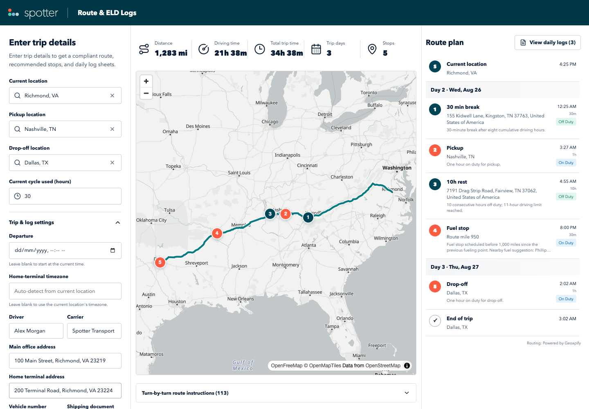
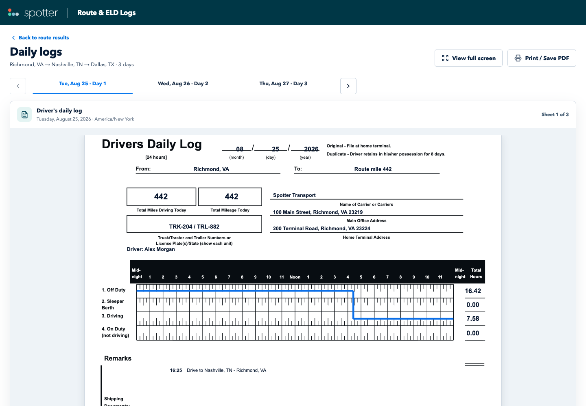

# Route & ELD Logs

A stateless Django and React assessment app that builds a heavy-truck route from the driver's current location through pickup to drop-off, schedules fuel/break/rest events under the stated property-carrying HOS assumptions, and renders one filled paper-style daily log for every calendar day touched by the trip.

> Generated trip plan — not a certified ELD record.

## What is included

- React 19, TypeScript, and Vite frontend with `/` route results and `/logs` daily logs.
- Django REST Framework API with no database, authentication, history, or admin surface.
- Geoapify adapter for worldwide autocomplete, `heavy_truck` routing, reverse geocoding/timezone lookup, and nearby fuel stations. Driving-hours rules remain based on US property-carrying HOS assumptions.
- Deterministic demo routing when no Geoapify key is configured, so reviewers can run the complete flow offline.
- MapLibre with the OpenFreeMap Positron style and visible provider attribution.
- One canonical `DutyEvent` sequence used by the stops, itinerary, summary, and daily log projections.
- A code-native SVG recreation of the supplied paper-log layout, with sharp vector labels, rules, duty traces, fullscreen viewing, and print/PDF controls. The original `blank-paper-log.png` remains only as the visual reference.

## Screenshots

### Route, stops, and HOS itinerary



### Filled daily log



## Run locally

Requirements: Python 3.12+, Node 22+, and pnpm 11.

Install and start the API:

```bash
python3.12 -m venv backend/.venv
backend/.venv/bin/pip install -r backend/requirements-dev.txt
cp .env.example .env
backend/.venv/bin/python backend/manage.py runserver 127.0.0.1:8000
```

There is one local environment file: `.env` in the project root. It is ignored by Git. The API uses its deterministic demo provider by default. For real road routing, edit the root `.env` and set:

```dotenv
GEOAPIFY_API_KEY=your-key
USE_DEMO_PROVIDER=false
```

Restart the API after changing `.env`. No database setup or migration is required; the API deliberately stores no application data.

In another terminal, install and start the frontend:

```bash
pnpm install
pnpm --filter frontend dev
```

Open `http://127.0.0.1:5173`. The frontend defaults to `http://127.0.0.1:8000`; override it with `VITE_API_BASE_URL` in the same root `.env`.

## Sample trip

The form starts with a review-ready example:

- Current location: Richmond, VA
- Pickup: Nashville, TN
- Drop-off: Dallas, TX
- Current cycle used: 30 hours

Select an autocomplete result for each location, then choose **Generate route & logs**. The deterministic route is intentionally long enough to demonstrate breaks, a 10-hour rest, a fuel stop, multiple dates, and filled daily sheets.

## Architecture

```text
frontend (React/Vite)
  location autocomplete ───────────────┐
  route map + itinerary                │ JSON
  daily SVG log sheets                 │
  sessionStorage (last result only)    ▼
backend (Django REST Framework)
  request validation → routing provider → pure HOS scheduler
                                      → daily-log projection
  Geoapify provider or deterministic demo provider
```

The API stays stateless. The browser stores only the last successful response in versioned `sessionStorage`, allowing `/logs` to survive an in-tab refresh without creating trip history.

## API

### `GET /api/v1/health`

Returns service health and the active provider (`demo` or `geoapify`).

### `GET /api/v1/locations/suggest?q=...`

Returns worldwide location candidates as `{ id, label, city, state, country, lat, lon }`. A typed value is not accepted as a waypoint until the user chooses an unambiguous candidate.

### `POST /api/v1/trip-plans`

Request:

```json
{
  "current_location": {"id": "...", "label": "Chicago, IL, USA", "lat": 41.8781, "lon": -87.6298},
  "pickup_location": {"id": "...", "label": "Nashville, TN, USA", "lat": 36.1627, "lon": -86.7816},
  "dropoff_location": {"id": "...", "label": "Dallas, TX, USA", "lat": 32.7767, "lon": -96.797},
  "current_cycle_used_hours": 24,
  "metadata": {
    "driver_name": "",
    "carrier_name": "",
    "main_office_address": "",
    "home_terminal_address": "",
    "vehicle_number": "",
    "shipping_document_number": ""
  }
}
```

`departure_at` and `home_terminal_timezone` are optional advanced inputs. When omitted, the API uses the current time and detects the timezone from the starting location; UTC is the explicit fallback when detection is unavailable. A local time that occurs twice at the end of daylight saving time must include its UTC offset (for example, `-04:00` or `-05:00`) so the intended instant is unambiguous.

The response contains route GeoJSON, turn-by-turn instructions, summary totals, scheduled stops, chronological duty events, daily logs, metadata, assumptions, warnings, the non-certified-record notice, and attribution.

Errors use one stable envelope:

```json
{
  "error": {
    "code": "validation_error",
    "message": "Current, pickup, and drop-off locations must differ.",
    "field": "dropoff_location",
    "retryable": false
  }
}
```

Provider timeouts, quota failures, unavailable routes, rejected credentials, invalid inputs, and identical waypoints are normalized into this shape.

Anonymous autocomplete and trip-generation requests have best-effort process-local throttles (`120/minute` and `30/hour` per client respectively). Deployments can tune these with `LOCATION_SUGGEST_RATE` and `TRIP_PLAN_RATE` without adding a database; strict cross-instance quota protection should be enforced at the hosting edge or with a shared cache.

## HOS model used by this assessment

- The driver begins after 10 consecutive hours off duty with fresh 11-hour and 14-hour clocks.
- Driving is capped at 11 hours and never begins or continues beyond the 14-hour window.
- A 30-minute non-driving interruption is inserted after eight cumulative driving hours; pickup, drop-off, or fueling also satisfy it when they occur in time.
- Pickup and drop-off are exactly one hour of On Duty—not driving.
- Fuel is targeted at 950 miles, keeping every fuel interval below 1,000 miles. Fueling is 30 minutes On Duty—not driving. A station name is shown only when the provider returns one within five straight-line miles; the distance is disclosed and the station is not silently added as a route detour.
- The initial cycle balance is `70 - current_cycle_used_hours`. A 34-hour restart is inserted before more driving when it reaches zero.
- A simultaneous cycle and daily reset becomes one 34-hour block.
- Pickup or drop-off work may finish after an arrival at a driving limit because those limits prohibit more driving, not all work.

Split sleeper berth, short-haul exceptions, adverse-condition extensions, team driving, personal conveyance, traffic, and weather are intentionally excluded.

Daily sheets are split at midnight in the home-terminal timezone. A driving event crossing midnight is interpolated to the correct route position for that sheet's From/To values and remarks. Time before departure and after trip completion is Off Duty, active statuses carry through midnight, the four paper-grid status totals reconcile to 24 hours, and daily mileage reconciles to route mileage. A trip ending exactly at midnight remains on the prior sheet with a `24:00` completion remark rather than creating an empty next-day sheet. On daylight-saving transition dates, the real 23- or 25-hour interval is projected monotonically onto the 24-hour paper grid and clearly noted.

## Checks

```bash
backend/.venv/bin/ruff check backend
backend/.venv/bin/python backend/manage.py check
backend/.venv/bin/pytest backend
pnpm --filter frontend lint
pnpm --filter frontend typecheck
pnpm --filter frontend test
pnpm --filter frontend build
pnpm --filter frontend test:e2e
```

The backend suite covers event ordering/non-overlap, 8/11/14-hour boundaries, pickup/fuel break qualification, 0/near-70/70 cycle inputs, combined resets, multiple fuel intervals, leg-aware route interpolation, midnight/timezone and daylight-saving splitting, mileage and 24-hour invariants, provider failures, and request validation. Frontend tests cover form and result interactions, storage, daily tabs, accessible remarks, responsive log controls, and metadata. Playwright starts isolated demo servers on dedicated ports and runs the complete generation-to-logs flow at desktop and mobile sizes, so a developer's real-provider servers cannot make the smoke test nondeterministic. GitHub Actions runs linting, type checks, both test suites, the production build, and these browser smoke tests.

## Deploy as two Vercel projects

Use this one repository for two projects:

1. **API project** — root directory `backend`; add `GEOAPIFY_API_KEY`, `USE_DEMO_PROVIDER=false`, a strong unique `DJANGO_SECRET_KEY` of at least 50 characters, `DJANGO_DEBUG=false`, `DJANGO_ALLOWED_HOSTS`, and `CORS_ALLOWED_ORIGINS`. Python 3.12 is pinned in `backend/.python-version`. HTTPS redirect, secure-cookie, and one-year HSTS defaults turn on automatically when debug is false.
2. **Frontend project** — root directory `frontend`; add `VITE_API_BASE_URL` with the deployed API origin.

Both folders include Vercel routing configuration. Add the final production origins to the backend host/CORS variables before the first end-to-end production check.

- Frontend URL: _add after deployment_
- API URL: _add after deployment_

Before sharing the assessment, verify the API health endpoint reports `geoapify`, generate one real route from the production frontend, open every daily sheet, and save a PDF once. Then replace the two URL placeholders above and add the GitHub and Loom links to the submission.

## Suggested 3–5 minute Loom outline

1. Show the four assessment inputs and collapsed trip/log settings.
2. Generate the sample route and point out summary metrics, numbered map stops, itinerary, directions, assumptions, and warnings.
3. Open a multi-day example and move across date tabs.
4. Show the filled log trace, totals, remarks, fullscreen view, and Print/Save PDF.
5. Briefly show the Django scheduling/projection modules and React page/component structure.
6. End with the automated checks, Vercel configuration, demo-vs-Geoapify behavior, and known limitations.

## Limitations

- This is a planning aid, not an FMCSA-certified ELD, legal opinion, dispatch system, or navigation product.
- The starting cycle value is a simplified scalar; historical eight-day log records are not available, so a full rolling recap cannot be reconstructed.
- Demo mode uses deterministic interpolated geometry and estimated driving speed. Configure Geoapify for road-level truck routes and real place data.
- Fuel lookup accepts only suggestions within five straight-line miles and keeps the scheduled marker anchored to the route; it reports the offset and does not claim or add an unmodeled station-driveway detour.
- No account, database, saved trip history, collaborative workflow, or server-side PDF archive is included by design.
